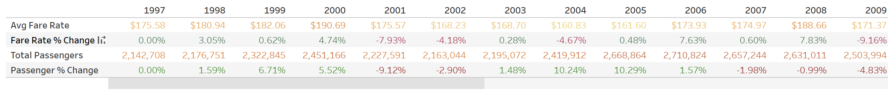
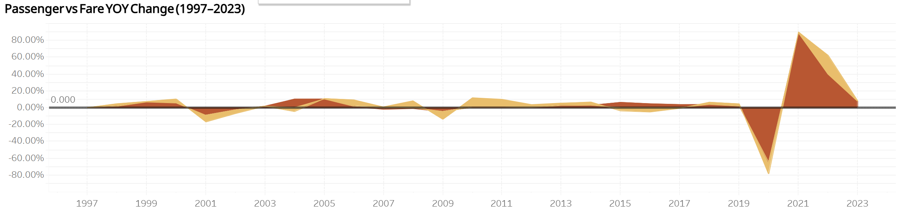

# Airfare Price and Passenger Rate Analysis (1997-2023)

## Table of Contents
- [Business Questions](#dataset-overview)
- [Project Overview](#background-and-overview)
- [Summary of Insights](#executive-summary)
- [Limitations](#key-insights)
- [Recommendations](#insights-to-action)

## Business Questions 
- Is airline passenger demand price sensitive at the industry level?
- Do fare increases consistently lead to declines in passenger volume?
- Are major passenger declines more closely aligned with fare changes or macroeconomic disruptions?

## Project Overview
This project analyzes US airline passenger demand and average airfares from 1997 to 2023 to evaluate whether airline demand is price sensitive. The goal was to determine whether fare increases consistently lead to declines in passenger volume or whether macroeconomic disruptions play a larger role in demand fluctuations.

### Data Collection
This data was collected on Kaggle. It can be found here: [Kaggle US Airline Flight Routes and Fares](https://www.kaggle.com/datasets/amitzala/us-airline-flight-routes-and-fares?)

### Dashboard Preview 

Table that shows YOY percent changes in average fare rates and passenger change

Area graph that shows the results 

The full Tableau dashboard can be found [here](https://public.tableau.com/app/profile/karl.r6258/viz/airfare_17721211767540/Dashboard1)

 
